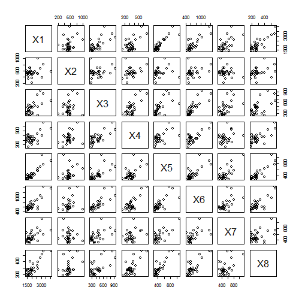
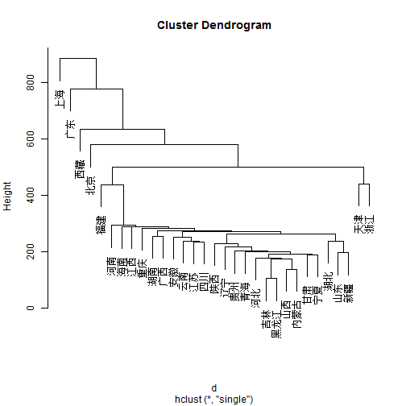
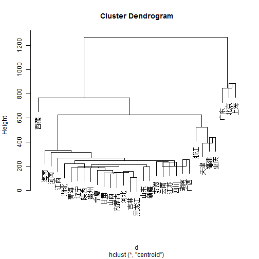
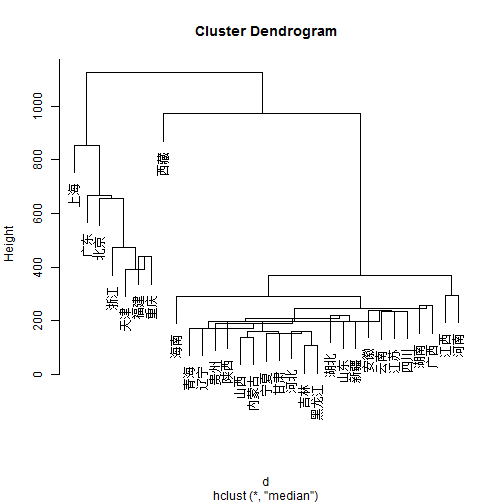
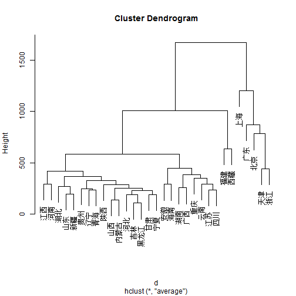
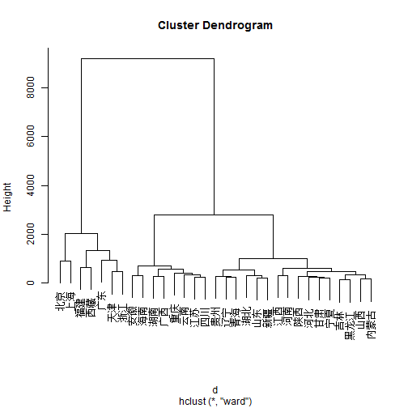
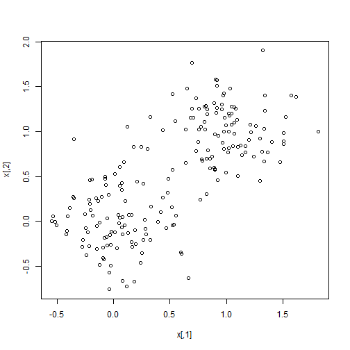
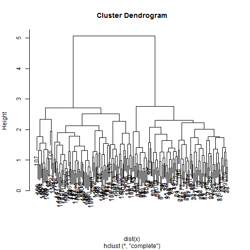
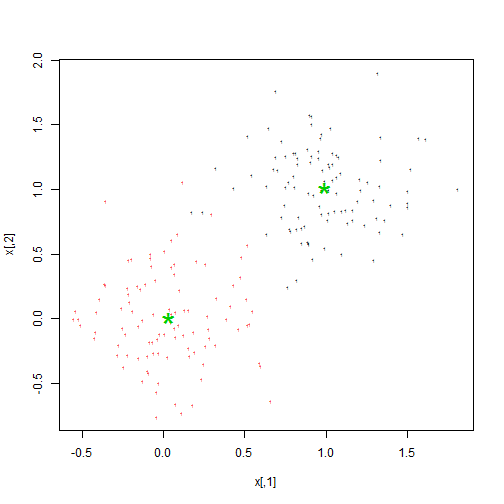

多元统计分析R语言应用——聚类分析
=================================

聚类分析是研究“物以类聚”的一种现代统计分析方法。主要分为三类：系统聚类法，快速聚类法，模糊聚类法。

>聚类的统计量
>
>距离
>>欧式距离
>>
>>马氏距离
>>
>>兰氏距离
>
>相似系数
>>夹角余弦
>>
>>相关系数

欧式距离(Minkowski):$d_{ij}(q) = [\sum_{k = 1}^{p}(x_{ik} - x_{jk})^q]^{\frac{1}{q}}$

* q = 1 时，称为绝对距离(manhattan)
* q = 2 时，称为欧氏距离(enclidean)
* q = $\infty$ 时，称为切比雪夫距离(maximun)

马氏距离(Mahalanobis): $d_{ij}(M) = (x_i - x_j)'{\sum}^{-1} (x_i - x_j)$

兰氏距离(Canberra): $d_{ij}(LW) = \frac{1}{p}\sum_{k = 1}^{p}\frac{\left | x_{ik} - x_{jk} \right |}{x_{ik} + x_{jk}}~~~~~~~(x_{ij}>0)$

#### R语言计算函数：
```{text}
dist(x, method = "euclidean", diag = FALSE, upper = FLASE, p =2)

 x为数据矩阵，数据框架
 method为计算方法，包括"enclidean","maximum","manhattan","canberra","binary","minkowski"
 diag为是否包含对角线元素，默认为FLASE
 upper为是否需要上三角，默认为FLASE
 p为Minkowski距离的幂次
```
相似系数

1. 夹角余弦: $C_{ij}(1) = \frac{\sum_{k = 1}^{n}x_{ki}x_{kj}}{[(\sum_{k = 1}^{n}x_{ki}^2) (\sum_{k = 1}^{n}x_{kj}^2)]^{\frac{1}{2}}}$
2. 相关系数: $C_{ij}(2) = \frac{ \sum_{k = 1}^{n}  (x_{ki}-\bar{x_i})  (x_{kj}-\bar{x_j})}
                 { \sqrt{  \sum_{k = 1}^{n} (x_{ki}-\bar{x_i})^2  \sum_{k = 1}^{n} (x_{kj}-\bar{x_j})^2  } }$

系统聚类法
----------

总共有6种方法：

1. 最短距离法：刻画类$G_p$与类$G_q$中最邻近的两个样品的距离。(single)
2. 最长距离法：刻画类$G_p$与类$G_q$中最远的两个样品的距离。(complete)
3. 重心法：一个类用它的重心（即该类样品的均值）作代表较为合适，类与类之间的距离用重心之间的距离来表示，距离一般用欧式距离。(average)
4. 中间距离法：该方法是对最短距离法和最长距离法的一个折中。(median)
5. 类平均法：将两类之间的距离平方定义为这两类元素两两之间的平均来计算距离。(centroid)
6. 离差平方和法(Ward法)：基于方差分析，如果分类正确，同类样品的离差平方和应当较小，类与类之间的离差平方和应当较大。(ward)

#### R语言计算函数：
```{text}
hclust(d, method = "complete",...)

 d为相似矩阵
 method为系统聚类方法，包括 "ward", "single", "complete", "average", "mcquitty", "median", "centroid"
```

### 例题

为了研究我国31个省、市、自治区2001年城镇居民消费的分布规律，根据调查资料作区域消费类型划分。指标为：
```{text}
          X1	    X2	    X3	    X4	    X5	     X6	    X7	    X8
北京	3229.28	821.72	847.39	677.66	768.34	1429.15	587.98	561.19
天津	2588.1	531.97	806.36	435.38	585.94	897.02	808.05	334.4
河北	1583.68	530.02	399.04	420.15	390.24	498.06	461.18	197.39
山西	1412.95	518.1	316.99	347.49	317.83	567.85	391.06	250.74
内蒙古	1423.22	594.69	292.42	268.88	390.18	548.21	403.69	274.33
辽宁	1846.11	592.01	272.75	378.31	347.47	575.06	412.09	230.62
吉林	1650.95	547.04	257.73	325.37	344.97	528.61	453.85	228.7
黑龙江	1561	531.98	259.61	353.48	318.34	534.22	432.09	201.64
上海	4021.77	577.39	642.08	557.96	875.35	1359.75	732.44	569.37
江苏	2194.04	525.88	603.36	297.46	483.77	691.5	438.16	298.58
浙江	2888.28	669.03	926.68	532.69	689	1065.1	724.46	457.15
安徽	1998.95	466.55	327.36	205.13	333.39	585.44	407.13	193.7
福建	2651.11	506.94	488.37	283.24	559.69	598.95	639.83	287
江西	1587.55	353.44	292.1	149.98	310.94	488.24	527.16	185.11
山东	1801.34	700.29	522.36	327.49	411.29	777.79	441.46	270.38
河南	1424.9	484.16	333.24	298.74	299.89	427.88	650.25	191.1
湖北	1799.38	582.66	347.84	241.87	336.19	698.89	586.33	211.63
湖南	1943.55	551.47	460.15	328.63	474.69	826.89	662.4	298.45
广东	3089.63	382.98	556.14	392.41	1075.32	961.79	1126.74	514.61
广西	1968.02	363.16	480.73	253.23	457.24	704.58	740.06	257.72
海南	2022.19	208.83	282.49	243.85	349.44	525.92	460.06	275.06
重庆	2337.65	589.28	509.82	334.05	442.5	850.15	563.72	246.51
四川	2082.18	489.78	460.55	300.26	381.47	674.8	530.25	256.88
贵州	1748.83	486.2	361.88	249.39	371.68	522.74	333.73	199.45
云南	2105.66	535.41	306.73	369.63	467.6	595.92	508.82	362.84
西藏	2626.99	1001.52	258.21	220.06	628.39	494.99	369.1	395.13
陕西	1589.44	443.74	529.68	361.18	366.3	642.45	452.73	252.22
甘肃	1639.17	537.94	367.32	361.4	320.88	592.72	322.94	277.94
青海	1790.27	532.51	350.85	374.4	361.9	594.03	295.48	399.14
宁夏	1562.57	572.03	469.18	409.96	437.72	542.39	323.16	278.39
新疆	1716.8	690.14	440.37	302.82	406.72	626.58	474.61	273.37

X1：人均食品支出                    X5：人均交通和通信支出
X2：人均衣着商品支出                X6：人均娱乐教育文化服务支出
X3：人均家庭设备用品及服务支出      X7：人均居住支出
X4：人均医疗保健支出                X8：人均杂项商品和服务支出
```

下面采用欧式距离，分别用最短距离法、最长距离法、类平均法、中间距离法、重心法和Ward法得出有关数据和系统图。


```r
d7.2 = read.table("d7.2.txt", header = T)
plot(d7.2)
```

 

```r
d = dist(d7.2)  #计算欧式距离
plot(hclust(d, method = "single"))  #最短距离法
```

 

```r
plot(hclust(d, method = "complete"))  #最长距离法
```

 

```r
plot(hclust(d, method = "centroid"))  #类平均法
```

 

```r
plot(hclust(d, method = "median"))  #中间距离法
```

 

```r
plot(hclust(d, method = "average"))  #重心法
```

 

```r
plot(hclust(d, method = "ward"))  #Ward法
```

 


快速Kmeans聚类法
----------------

该算法适用于样本容量不是很大的时候，对计算机性能要求不高。基本思想是将每一个样品分配给最近中心的类中。K均值法只能产生只能类数的聚类结果。

Kmeans算法以$k$为参数,把n个对象分为$k$个聚类，以使聚类内具有较高的相似度，而聚类间的相似度较低。

R语言函数

```{text}
kmeans(x,centers,...)
x为数据矩阵或数据框
centers为聚类数或出事聚类中心
```

#### 例题

对随机数进行聚类分析


```r
x1 = matrix(rnorm(1000, mean = 0, sd = 0.3), ncol = 10)  #生成1000个均值为0，标准差为0.3的10列100行的正态随机矩阵。
x2 = matrix(rnorm(1000, mean = 1, sd = 0.3), ncol = 10)  #生成1000个均值为1，标准差为0.3的10列100行的正态随机矩阵。
x = rbind(x1, x2)  #将x1和x2拼接起来
plot(x)  # 绘制x图形
```

 

```r
plot(hclust(dist(x), method = "complete"))  #用最长距离法进行聚类
```

 

```r
(cl = kmeans(x, 2))  #用Kmeans聚类法进行聚类
```

```
## K-means clustering with 2 clusters of sizes 100, 100
## 
## Cluster means:
##      [,1]     [,2]    [,3]       [,4]     [,5]     [,6]    [,7]    [,8]
## 1 0.98984 1.013402 1.02397  0.9544495 1.023591  0.97590 1.02497 1.02384
## 2 0.03019 0.007272 0.02609 -0.0006242 0.006982 -0.02537 0.01674 0.01616
##       [,9]     [,10]
## 1  1.03180  0.989378
## 2 -0.05343 -0.003422
## 
## Clustering vector:
##   [1] 2 2 2 2 2 2 2 2 2 2 2 2 2 2 2 2 2 2 2 2 2 2 2 2 2 2 2 2 2 2 2 2 2 2 2
##  [36] 2 2 2 2 2 2 2 2 2 2 2 2 2 2 2 2 2 2 2 2 2 2 2 2 2 2 2 2 2 2 2 2 2 2 2
##  [71] 2 2 2 2 2 2 2 2 2 2 2 2 2 2 2 2 2 2 2 2 2 2 2 2 2 2 2 2 2 2 1 1 1 1 1
## [106] 1 1 1 1 1 1 1 1 1 1 1 1 1 1 1 1 1 1 1 1 1 1 1 1 1 1 1 1 1 1 1 1 1 1 1
## [141] 1 1 1 1 1 1 1 1 1 1 1 1 1 1 1 1 1 1 1 1 1 1 1 1 1 1 1 1 1 1 1 1 1 1 1
## [176] 1 1 1 1 1 1 1 1 1 1 1 1 1 1 1 1 1 1 1 1 1 1 1 1 1
## 
## Within cluster sum of squares by cluster:
## [1] 94.65 96.82
##  (between_SS / total_SS =  72.5 %)
## 
## Available components:
## 
## [1] "cluster"      "centers"      "totss"        "withinss"    
## [5] "tot.withinss" "betweenss"    "size"
```

```r
pch1 = rep("1", 1000)
pch2 = rep("2", 1000)  #生成两组1000长度的标记文字
plot(x, col = cl$cluster, pch = c(pch1, pch2), cex = 0.4)  #绘制快速聚类分析的结果图，并标记结果
points(cl$centers, col = 3, pch = "*", cex = 3)  #标记中心
```

 


总结
----

* 聚类分析较为客观、直观、并且能够克服单一指标分类的弊端。
* kmeans算法只有在类的平均值被定义的情况下才能使用，必须事先给出k，可以结合系统聚类法先计算少量的值对其聚类，计算k值后，再用kmeans算法进行计算。
* 数据的不同维度之间的量纲不同也可以进行聚类，当通常需要进行变换，常用的变换有：平移变换、极差变换、标准差变换、主成分变换、对数变换等等。
* 两个变量间的相似程度越高，其距离越小或相似系数的绝对值越大，反之亦然。
