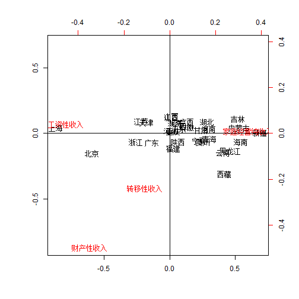

多元统计分析R语言应用——对应分析
=================================

对应分析是在因子分析的基础上发展起来的，因子分析分为R型因子分析和Q型因子分析，分别对变量和样品做因子分析，对应分析是将R型分析和Q型分析统一起来，通过R型因子分析直接得到Q型因子分析的结果，同时把变量和样品反映到相同的坐标轴的一张图形上，以此说明变量与样品之间的对应关系。

对应分析是研究两组或两组以上变量之间关系的有效方法。分对析的对象是二维或多维的列联表，首先进行因素的独立性检验，一般用卡方检验来分析它们之间的关系。如果两个因素独立，则没有必要进行对应分析；如果两个因素不独立，则可以通过对应分析的方法考察各个水平之间的相关关系。

对应分析步骤：

1. 由数据矩阵X，计算规格化的概率矩阵
2. 计算过渡矩阵Z
3. 进行因子分析

卡方检验和对应分析的R语言函数：
```{text}
chisq.test(X) #卡方分析函数
X 为样本

corresp(X, nf = 1, ...) #对应分析函数，在MASS包中。
X 表示进行对应分析的数据矩阵
nf 表示计算因子的个数
```

### 例题

对我国农村居民家庭纯收入进行对应分析。（数据见d10.2.xls）


```r
X = read.table("d10.2.txt", header = T)  #读入数据
library(MASS)  #导入相关包
chisq.test(X)  #进行卡方分析
```

```
## 
## 	Pearson's Chi-squared test
## 
## data:  X
## X-squared = 13276, df = 90, p-value < 2.2e-16
```

```r
# 由卡方分析结果可知，两个因素不独立，可以进行因子分析。
(CA = corresp(X, nf = 2))  #计算行和列得分
```

```
## First canonical correlation(s): 0.38294 0.09419 
## 
##  Row scores:
##            [,1]     [,2]
## 北京   -1.55186 -1.60567
## 天津   -0.45924  0.89624
## 河北    0.02590  0.25210
## 山西    0.03451  1.39747
## 内蒙古  1.38094  0.45620
## 辽宁    0.17371  0.85336
## 吉林    1.35888  1.21916
## 黑龙江  1.20607 -1.39802
## 上海   -2.26958  0.47446
## 江苏   -0.56324  0.99787
## 浙江   -0.66884 -0.70210
## 安徽    0.34667  0.49931
## 福建    0.07080 -1.18833
## 江西    0.03920  1.36272
## 山东    0.19670  0.40057
## 河南    0.78472  0.36297
## 湖北    0.74659  0.93402
## 湖南    0.11139  0.87803
## 广东   -0.35656 -0.72357
## 广西    0.34125  0.96023
## 海南    1.42045 -0.68681
## 重庆    0.07842  0.20843
## 四川    0.33885  0.63071
## 贵州    0.65895 -0.66512
## 云南    1.06122 -1.56333
## 西藏    1.09491 -3.29110
## 陕西    0.17349 -0.66251
## 甘肃    0.62554  0.30466
## 青海    0.79756 -0.45625
## 宁夏    0.59550 -0.58929
## 新疆    1.79830  0.08833
## 
##  Column scores:
##                   [,1]   [,2]
## 工资性收入     -1.1805  0.433
## 家庭经营纯收入  0.8937  0.112
## 财产性收入     -0.9138 -5.280
## 转移性收入     -0.2856 -2.548
```

```r
biplot(CA)
abline(v = 0, h = 0, Ity = 3)  #作对应分析图
```

 


结果显示绝大部分省份都是家庭经营性收入，而北京和上海主要为工资性收入，几乎没有那个省份主要是财产性收入，也没有哪个省份主要是转移性收入。
