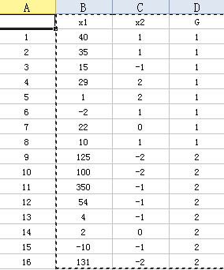

多元统计判别分析R语言应用――判别分析
===================================

Fisher线性判别
--------------

例题

>某银行从历史贷款客户中随机抽取16个样本，根据设计的指标体系分别计算他们的“商业信用支持度”($x1$)和“市场竞争地位体系”($x2$),类别变量$G$中,1代表贷款成功，2代表贷款失败。
>
>1. 建立Fisher线性判别模型
>2. 根据建立的模型，判别是否支持某客户($x1 = 131, x2 = -2$)提供贷款。

数据如图

计算如下：


```r
e6.1 = read.table("e6.1.txt", header = T)  #导入数据
attach(e6.1)
```


标出两个变量与贷款成功与否的关系图：


```r
plot(x1, x2)
text(x1, x2, G, adj = -0.4)
```

 


建立模型：


```r
library(MASS)
(ld = lda(G ~ x1 + x2))  #建立Fisher线性判别模型
```

```
## Call:
## lda(G ~ x1 + x2)
## 
## Prior probabilities of groups:
##   1   2 
## 0.5 0.5 
## 
## Group means:
##      x1     x2
## 1 18.75  0.875
## 2 94.50 -1.250
## 
## Coefficients of linear discriminants:
##          LD1
## x1  0.002395
## x2 -1.099751
```

```r
Z = predict(ld)  #对自身进行判别
cbind(G, Z$x, Z$class)  #查看判别情况
```

```
##    G     LD1  
## 1  1 -1.3458 1
## 2  1 -1.3578 1
## 3  1  0.7938 2
## 4  1 -2.4719 1
## 5  1 -2.5390 1
## 6  1 -1.4464 1
## 7  1 -0.2891 1
## 8  1 -1.4176 1
## 9  2  2.1571 2
## 10 2  2.0972 2
## 11 2  1.5963 2
## 12 2  0.8873 2
## 13 2  0.7675 2
## 14 2 -0.3371 1
## 15 2  0.7340 2
## 16 2  2.1715 2
```

```r
(tab = table(G, Z$class))  #查看错判情况
```

```
##    
## G   1 2
##   1 7 1
##   2 1 7
```

```r
sum(diag(prop.table(tab)))  #判别符合率
```

```
## [1] 0.875
```


对新提出的数据进行判别


```r
(Z1 = predict(ld, data.frame(x1 = 131, x2 = -2)))
```

```
## $class
## [1] 2
## Levels: 1 2
## 
## $posterior
##          1      2
## 1 0.004199 0.9958
## 
## $x
##     LD1
## 1 2.171
```


我们可以从Z1的class中看出，这组数据被判别为G = 2， 也就意味着不应为这位客户贷款。

二次判别（异方差）
-----------------

当协方差阵不相同时，距离判别函数为非线性形式，一般为二次函数。


```r
(qd = qda(G ~ x1 + x2))  #建立二次判别模型
```

```
## Call:
## qda(G ~ x1 + x2)
## 
## Prior probabilities of groups:
##   1   2 
## 0.5 0.5 
## 
## Group means:
##      x1     x2
## 1 18.75  0.875
## 2 94.50 -1.250
```

```r
Z = predict(qd)  #对自身进行判别
cbind(G, Z$class)  #查看判别情况
```

```
##       G  
##  [1,] 1 1
##  [2,] 1 1
##  [3,] 1 1
##  [4,] 1 1
##  [5,] 1 1
##  [6,] 1 1
##  [7,] 1 1
##  [8,] 1 1
##  [9,] 2 2
## [10,] 2 2
## [11,] 2 2
## [12,] 2 2
## [13,] 2 2
## [14,] 2 1
## [15,] 2 2
## [16,] 2 2
```

```r
(tab = table(G, Z$class))  #查看错判情况
```

```
##    
## G   1 2
##   1 8 0
##   2 1 7
```

```r
sum(diag(prop.table(tab)))  #计算符合率
```

```
## [1] 0.9375
```


我们可以从错判情况看出二次判别比一次判别错判要少，从符合率上看，二次判别的符合率更高，效果好于一次判别的效果。

对数据进行判别：


```r
(Z1 = predict(qd, data.frame(x1 = 131, x2 = -2)))
```

```
## $class
## [1] 2
## Levels: 1 2
## 
## $posterior
##           1 2
## 1 8.217e-13 1
```


结果与一次判别相同。

Bayes判别法
-----------

Bayes判别是一个体归属于某类的概率（或某类的判别函数值）最大或错判总平均损失最小为标准的。
相关概念：先验概率q、后验概率。

d6.3数据介绍：

1. G表示销售状态：1.表示畅销；2.表示平销；3.表示滞销。
2. Q表示质量评分
3. C表示功能评分
4. P表示销售价格

### 当**先验概率相等**时，取$q1 = q2 = q3 = 1/3$,此时判别函数等价于Fisher线性判别函数。


```r
d6.3 = read.table("d6.3.txt", header = T)  #导入变量
attach(d6.3)  #解析变量
```

```
## 下列对象被屏蔽了from e6.1:
## 
##     G
```

```r
(ld1 = lda(G ~ Q + C + P, prior = c(1, 1, 1)/3))  #建立模型
```

```
## Call:
## lda(G ~ Q + C + P, prior = c(1, 1, 1)/3)
## 
## Prior probabilities of groups:
##      1      2      3 
## 0.3333 0.3333 0.3333 
## 
## Group means:
##       Q     C     P
## 1 8.400 5.900 48.20
## 2 7.713 7.250 69.88
## 3 5.957 3.714 34.00
## 
## Coefficients of linear discriminants:
##        LD1      LD2
## Q -0.92307  0.76708
## C -0.65223  0.11482
## P  0.02743 -0.08484
## 
## Proportion of trace:
##    LD1    LD2 
## 0.7259 0.2741
```

```r
Z1 = predict(ld1)  #对自身进行判别
cbind(G, Z1$x, Z1$class)  #查看判别情况
```

```
##    G      LD1      LD2  
## 1  1 -0.40839  2.37788 1
## 2  1 -2.40289  0.33403 1
## 3  1 -0.50937  1.41417 1
## 4  1 -0.95822  0.25030 1
## 5  1 -1.78725  0.84260 1
## 6  2 -2.54179  0.85631 1
## 7  2  0.74904 -2.29239 2
## 8  2 -2.39414 -0.96906 2
## 9  2 -1.04572 -0.73175 2
## 10 2 -1.34999 -2.76030 2
## 11 2 -0.76438 -2.78518 2
## 12 2  0.04715 -0.77130 2
## 13 2  0.38367  0.11363 3
## 14 3  2.77223  1.14753 3
## 15 3  1.61977  0.07201 3
## 16 3  0.84521 -0.26991 3
## 17 3  3.10536 -0.11489 3
## 18 3  2.30770  0.14824 3
## 19 3  2.31337 -0.19415 3
## 20 3  1.58059  0.07712 3
```

```r
table(G, Z1$class)  #查看错判情况
```

```
##    
## G   1 2 3
##   1 5 0 0
##   2 1 6 1
##   3 0 0 7
```

```r
Z1$post  #后验概率
```

```
##            1         2         3
## 1  9.826e-01 0.0055570 1.186e-02
## 2  7.942e-01 0.2056795 8.863e-05
## 3  9.372e-01 0.0431044 1.969e-02
## 4  6.537e-01 0.3371446 9.147e-03
## 5  9.052e-01 0.0943611 4.798e-04
## 6  9.278e-01 0.0721271 4.054e-05
## 7  3.336e-03 0.8632226 1.334e-01
## 8  1.775e-01 0.8224630 6.760e-05
## 9  1.847e-01 0.8105204 4.783e-03
## 10 2.847e-03 0.9969782 1.751e-04
## 11 2.196e-03 0.9968539 9.497e-04
## 12 1.112e-01 0.7798203 1.090e-01
## 13 2.918e-01 0.3250330 3.832e-01
## 14 7.594e-04 0.0001978 9.990e-01
## 15 1.210e-02 0.0227472 9.652e-01
## 16 7.941e-02 0.2426609 6.779e-01
## 17 7.945e-05 0.0003790 9.995e-01
## 18 1.392e-03 0.0028100 9.958e-01
## 19 9.960e-04 0.0042953 9.947e-01
## 20 1.377e-02 0.0252494 9.610e-01
```


### 当**先验概率不相等**时，取$q1 = 5/20, q2 = 8/20, q3 = 7/20$，求解Bayes判别函数的系数，并进行自身判别。


```r
(ld2 = lda(G ~ Q + C + P, prior = c(5, 8, 7)/20))  #建立模型
```

```
## Call:
## lda(G ~ Q + C + P, prior = c(5, 8, 7)/20)
## 
## Prior probabilities of groups:
##    1    2    3 
## 0.25 0.40 0.35 
## 
## Group means:
##       Q     C     P
## 1 8.400 5.900 48.20
## 2 7.713 7.250 69.88
## 3 5.957 3.714 34.00
## 
## Coefficients of linear discriminants:
##        LD1      LD2
## Q -0.81173  0.88406
## C -0.63091  0.20135
## P  0.01579 -0.08776
## 
## Proportion of trace:
##    LD1    LD2 
## 0.7403 0.2597
```

```r
Z2 = predict(ld2)  #对自身进行判别
cbind(G, Z2$x, Z2$class)  #查看判别情况
```

```
##    G     LD1       LD2  
## 1  1 -0.1410  2.582952 1
## 2  1 -2.3918  0.825366 1
## 3  1 -0.3704  1.641515 1
## 4  1 -0.9715  0.548448 1
## 5  1 -1.7135  1.246682 1
## 6  2 -2.4594  1.361571 1
## 7  2  0.3790 -2.200432 2
## 8  2 -2.5581 -0.467096 2
## 9  2 -1.1900 -0.412972 2
## 10 2 -1.7639 -2.382302 2
## 11 2 -1.1869 -2.485575 2
## 12 2 -0.1124 -0.598884 2
## 13 2  0.3399  0.232863 3
## 14 3  2.8457  0.936723 3
## 15 3  1.5592  0.025668 3
## 16 3  0.7458 -0.209168 3
## 17 3  3.0063 -0.358990 3
## 18 3  2.2512  0.008852 3
## 19 3  2.2108 -0.331207 3
## 20 3  1.5211  0.035985 3
```

```r
table(G, Z2$class)  #查看错判情况
```

```
##    
## G   1 2 3
##   1 5 0 0
##   2 1 6 1
##   3 0 0 7
```

```r
Z2$post  #后验概率
```

```
##            1         2         3
## 1  9.747e-01 0.0088199 1.647e-02
## 2  7.070e-01 0.2929274 1.104e-04
## 3  9.066e-01 0.0667162 2.666e-02
## 4  5.421e-01 0.4473099 1.062e-02
## 5  8.565e-01 0.1428620 6.356e-04
## 6  8.893e-01 0.1106146 5.440e-05
## 7  2.123e-03 0.8789839 1.189e-01
## 8  1.188e-01 0.8811091 6.337e-05
## 9  1.241e-01 0.8713953 4.500e-03
## 10 1.781e-03 0.9980655 1.534e-04
## 11 1.374e-03 0.9977942 8.318e-04
## 12 7.359e-02 0.8254938 1.009e-01
## 13 2.164e-01 0.3857093 3.979e-01
## 14 5.425e-04 0.0002261 9.992e-01
## 15 8.646e-03 0.0260023 9.654e-01
## 16 5.605e-02 0.2740443 6.699e-01
## 17 5.675e-05 0.0004331 9.995e-01
## 18 9.944e-04 0.0032115 9.958e-01
## 19 7.112e-04 0.0049073 9.944e-01
## 20 9.841e-03 0.0288659 9.613e-01
```


这个例题中无论先验概率是否相等，最终判别结果未出现差异，但是后验概率还是存在差异的。
