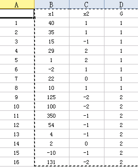

多元统计分析R语言应用——判别分析
=================================

Fisher线性判别
--------------

例题

>某银行从历史贷款客户中随机抽取16个样本，根据设计的指标体系分别计算他们的“商业信用支持度”($x1$)和“市场竞争地位体系”($x2$),类别变量$G$中,1代表贷款成功，2代表贷款失败。
>
>1. 建立Fisher线性判别模型
>2. 根据建立的模型，判别是否支持某客户($x1 = 131, x2 = -2$)提供贷款。

数据如图

计算如下：

```{r}
e6.1 = read.table("e6.1.txt", header = T) #导入数据
attach(e6.1)
```

标出两个变量与贷款成功与否的关系图：

```{r fig.width=7, fig.height=6}
plot(x1, x2); text(x1, x2, G, adj = -0.4)
```

建立模型：

```{r}
library(MASS)
(ld = lda(G ~ x1 + x2)) #建立Fisher线性判别模型
Z = predict(ld) #对自身进行判别
cbind(G,Z$x,Z$class ) #查看判别情况
(tab = table(G,Z$class )) #查看错判情况
sum(diag(prop.table(tab))) #判别符合率
```

对新提出的数据进行判别

```{r}
(Z1 = predict(ld, data.frame(x1 = 131, x2 = -2)))
```

我们可以从Z1的class中看出，这组数据被判别为G = 2， 也就意味着不应为这位客户贷款。

二次判别（异方差）
-----------------

当协方差阵不相同时，距离判别函数为非线性形式，一般为二次函数。

```{r}
(qd = qda(G~x1+x2)) #建立二次判别模型
Z = predict(qd) #对自身进行判别
cbind(G,Z$class) #查看判别情况
(tab = table(G,Z$class)) #查看错判情况
sum(diag(prop.table(tab))) #计算符合率
```

我们可以从错判情况看出二次判别比一次判别错判要少，从符合率上看，二次判别的符合率更高，效果好于一次判别的效果。

对数据进行判别：

```{r}
(Z1 = predict(qd, data.frame(x1 = 131, x2 = -2)))
```

结果与一次判别相同。

Bayes判别法
-----------

Bayes判别是一个体归属于某类的概率（或某类的判别函数值）最大或错判总平均损失最小为标准的。
相关概念：先验概率q、后验概率。

d6.3数据介绍：

1. G表示销售状态：1.表示畅销；2.表示平销；3.表示滞销。
2. Q表示质量评分
3. C表示功能评分
4. P表示销售价格

### 当**先验概率相等**时，取$q1 = q2 = q3 = 1/3$,此时判别函数等价于Fisher线性判别函数。

```{r}
d6.3 = read.table("d6.3.txt", header = T) #导入变量
attach(d6.3) #解析变量
(ld1 = lda(G~Q+C+P, prior = c(1, 1, 1)/3)) #建立模型
Z1 = predict(ld1) #对自身进行判别
cbind(G,Z1$x,Z1$class) #查看判别情况
table(G,Z1$class) #查看错判情况
Z1$post #后验概率
```

### 当**先验概率不相等**时，取$q1 = 5/20, q2 = 8/20, q3 = 7/20$，求解Bayes判别函数的系数，并进行自身判别。

```{r}
(ld2 = lda(G~Q+C+P, prior = c(5,8,7)/20)) #建立模型
Z2 = predict(ld2) #对自身进行判别
cbind(G,Z2$x,Z2$class) #查看判别情况
table(G,Z2$class) #查看错判情况
Z2$post #后验概率
```

这个例题中无论先验概率是否相等，最终判别结果未出现差异，但是后验概率还是存在差异的。
