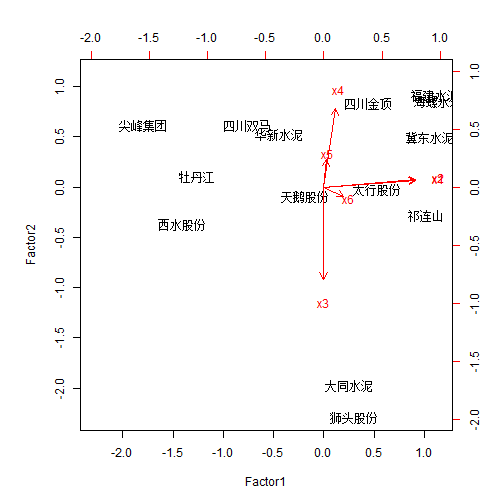

多元统计分析R语言应用——因子分析
=================================

因子分析是指研究从变量群中提取共性因子的统计技术。它是在主成分的基础上构筑若干意义较为明确的公因子，以它们为框架分解原变量，以此考察原变量间的联系和区别。因子分析就是从大量的数据中“由表及里”、“去粗取精”，寻找影响或支配变量的多变量统计方法。

因子分析法的基本思想是将观测变量进行分类，将相关性较高，即联系比较紧密的分在同一类中，而不同类变量之间的相关性则较低，那么每一类变量实际上就代表了一个基本结构，即公共因子。对于所研究的问题，试图用最少个数的不可测的公共因子的线性函数与特殊因子之和来描述原来观测的每一分量。

### 例题

根据中国上市公司的资料，截止2003年底，水泥行业上市公司有14家，收集2003年中期各项指标数据如下：

```{text}
	x1	x2	x3	x4	x5	x6
冀东水泥	33.8	34.75	0.67	59.77	15.49	16.35
大同水泥	27.54	28.04	2.36	35.29	-20.96	-46.45
四川双马	22.86	23.47	0.61	42.83	5.48	-49.22
牡丹江  	19.05	19.95	1	48.51	-12.32	-65.99
西水股份	20.84	21.17	1.08	48.45	65.09	54.81
狮头股份	28.14	28.84	2.51	24.52	-6.43	-15.94
太行股份	30.45	31.13	1.02	46.14	6.57	-16.59
海螺水泥	36.29	36.96	0.27	58.31	70.85	117.59
尖峰集团	16.94	17.26	0.61	52.04	9.03	-94.05
四川金顶	28.74	29.4	0.6	65.46	-33.97	-55.02
祁连山  	33.31	34.3	1.17	45.8	12.18	39.46
华新水泥	25.08	26.12	0.64	69.35	22.38	-10.2
福建水泥	34.51	35.44	0.38	61.61	23.91	-163.99
天鹅股份	25.52	26.73	1.1	47.02	-4.51	-68.79
```

进行因子分析。

#### R语言计算函数

```{text}
factanal(X, factors, scores = c("none", "regression", "Bartlett"), rotation = "varimax", ...) #因子分析函数
X 为数值矩阵或数据框
factors 为因子个数
scores 为因子得分的计算方法，包括 "regression", "Bartlett"
rotation 为因子旋转方法
```


```r
X = read.table("d9.1.txt", header = T)  #导入数据
# 由于观测数据很多，不可避免出现多重共线性问题，需要先计算一下相关矩阵。
cor(X)  #计算相关矩阵
```

```
##          x1      x2       x3       x4      x5       x6
## x1  1.00000  0.9992 -0.09975  0.18851  0.2010  0.29778
## x2  0.99920  1.0000 -0.10420  0.19673  0.1904  0.28748
## x3 -0.09975 -0.1042  1.00000 -0.83716 -0.4088  0.01519
## x4  0.18851  0.1967 -0.83716  1.00000  0.2585 -0.02928
## x5  0.20100  0.1904 -0.40876  0.25851  1.0000  0.58029
## x6  0.29778  0.2875  0.01519 -0.02928  0.5803  1.00000
```

```r
(FAC = factanal(X, 3, scores = "regression", rotation = "varimax"))  #极大似然法进行因子分析,回归估计法计算因子得分
```

```
## 
## Call:
## factanal(x = X, factors = 3, scores = "regression", rotation = "varimax")
## 
## Uniquenesses:
##    x1    x2    x3    x4    x5    x6 
## 0.005 0.005 0.005 0.271 0.005 0.548 
## 
## Loadings:
##    Factor1 Factor2 Factor3
## x1  0.983           0.155 
## x2  0.985           0.142 
## x3         -0.990  -0.124 
## x4  0.127   0.844         
## x5          0.293   0.953 
## x6  0.210           0.631 
## 
##                Factor1 Factor2 Factor3
## SS loadings      1.998   1.800   1.367
## Proportion Var   0.333   0.300   0.228
## Cumulative Var   0.333   0.633   0.861
## 
## The degrees of freedom for the model is 0 and the fit was 1.1422
```

```r
FAC$scores  #因子得分
```

```
##          Factor1  Factor2  Factor3
## 冀东水泥  1.0571  0.49858 -0.01932
## 大同水泥  0.2508 -1.97182 -0.55062
## 四川双马 -0.7619  0.61936 -0.35643
## 牡丹江   -1.2622  0.10831 -0.82490
## 西水股份 -1.4124 -0.36520  2.09840
## 狮头股份  0.2993 -2.28407  0.06540
## 太行股份  0.5368 -0.01725 -0.16548
## 海螺水泥  1.1383  0.86089  1.85549
## 尖峰集团 -1.7990  0.62143 -0.20236
## 四川金顶  0.4397  0.83905 -1.87521
## 祁连山    1.0220 -0.27756  0.10237
## 华新水泥 -0.4381  0.53317  0.26013
## 福建水泥  1.1144  0.91988  0.13561
## 天鹅股份 -0.1847 -0.08479 -0.52308
```


因子分析常有以下四个基本步骤：

1. 确认待分析的原变量是否适合作因子分析
2. 构造因子变量
3. 利用旋转方法使因子变量更具有可解释性
4. 计算因子变量得分

信息重叠图用法：
```{text}
biplot(scores, loadings, ...)
scores 为因子得分
loadings 为因子载荷
```

例题中绘制信息重叠图：

```r
biplot(FAC$scores, FAC$loadings)  #前两个因子图
```

 

