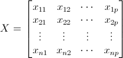
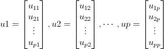

souce("源文件",echo=TRUE,encoding="utf-8")
多元统计分析R语言应用——主成分分析
===================================

主成分分析是将多指标化为少数几个综合指标的统计分析方法。方法是降维。数学上的处理就是对原来的p个指标作线性组合，作为新的指标。

主成分分析的步骤
----------------

### 计算步骤

1. 设有n个样品，p个指标，将原始数据标准化，得标准化数据矩阵：  
  
2. 建立变量的相关系数阵：$R = (r_{ij})_{p\times p} = X'X$。
3. 求R的特征值$\lambda_1 \geqslant \lambda_2 \geqslant \cdots > 0$及相应的单位特征向量：  
  
4. 写出主成分：$y_i = u_{i1}x_1 + u_{i2}x_2 + \cdots  + u_{ip}x_p$

#### R语言计算函数

```{text}
主成分分析函数
princomp(x, cor = FLASE, scores = TRUE, ...)
x为数据矩阵或数据框
cor为是否用相关矩阵，默认为协差阵
scores为是否输出成分得分

碎石图函数
screeplot(obj, type = c("barolot","lines", ...))
obj为主成分分析对象
type为图形类型
```

例题
----

对我国31个省、市、自治区的人均消费水平作分析评价，并根据因子得分和综合得分对各省市自治区的人均消费水平进行综合分析。


```r
X = read.table("d7.2.txt", header = T)  #导入数据
X  #显示数据
```

```
##          X1     X2    X3    X4     X5     X6     X7    X8
## 北京   3229  821.7 847.4 677.7  768.3 1429.2  588.0 561.2
## 天津   2588  532.0 806.4 435.4  585.9  897.0  808.0 334.4
## 河北   1584  530.0 399.0 420.1  390.2  498.1  461.2 197.4
## 山西   1413  518.1 317.0 347.5  317.8  567.9  391.1 250.7
## 内蒙古 1423  594.7 292.4 268.9  390.2  548.2  403.7 274.3
## 辽宁   1846  592.0 272.8 378.3  347.5  575.1  412.1 230.6
## 吉林   1651  547.0 257.7 325.4  345.0  528.6  453.9 228.7
## 黑龙江 1561  532.0 259.6 353.5  318.3  534.2  432.1 201.6
## 上海   4022  577.4 642.1 558.0  875.4 1359.8  732.4 569.4
## 江苏   2194  525.9 603.4 297.5  483.8  691.5  438.2 298.6
## 浙江   2888  669.0 926.7 532.7  689.0 1065.1  724.5 457.1
## 安徽   1999  466.6 327.4 205.1  333.4  585.4  407.1 193.7
## 福建   2651  506.9 488.4 283.2  559.7  599.0  639.8 287.0
## 江西   1588  353.4 292.1 150.0  310.9  488.2  527.2 185.1
## 山东   1801  700.3 522.4 327.5  411.3  777.8  441.5 270.4
## 河南   1425  484.2 333.2 298.7  299.9  427.9  650.2 191.1
## 湖北   1799  582.7 347.8 241.9  336.2  698.9  586.3 211.6
## 湖南   1944  551.5 460.1 328.6  474.7  826.9  662.4 298.4
## 广东   3090  383.0 556.1 392.4 1075.3  961.8 1126.7 514.6
## 广西   1968  363.2 480.7 253.2  457.2  704.6  740.1 257.7
## 海南   2022  208.8 282.5 243.8  349.4  525.9  460.1 275.1
## 重庆   2338  589.3 509.8 334.1  442.5  850.1  563.7 246.5
## 四川   2082  489.8 460.6 300.3  381.5  674.8  530.2 256.9
## 贵州   1749  486.2 361.9 249.4  371.7  522.7  333.7 199.4
## 云南   2106  535.4 306.7 369.6  467.6  595.9  508.8 362.8
## 西藏   2627 1001.5 258.2 220.1  628.4  495.0  369.1 395.1
## 陕西   1589  443.7 529.7 361.2  366.3  642.5  452.7 252.2
## 甘肃   1639  537.9 367.3 361.4  320.9  592.7  322.9 277.9
## 青海   1790  532.5 350.9 374.4  361.9  594.0  295.5 399.1
## 宁夏   1563  572.0 469.2 410.0  437.7  542.4  323.2 278.4
## 新疆   1717  690.1 440.4 302.8  406.7  626.6  474.6 273.4
```

```r
cor(X)  #计算相关矩阵
```

```
##        X1      X2     X3     X4     X5     X6      X7     X8
## X1 1.0000  0.2594 0.6552 0.5662 0.8866 0.8309  0.6020 0.8493
## X2 0.2594  1.0000 0.2139 0.3359 0.2386 0.2753 -0.1967 0.3551
## X3 0.6552  0.2139 1.0000 0.7024 0.6347 0.8148  0.5347 0.6191
## X4 0.5662  0.3359 0.7024 1.0000 0.5660 0.7689  0.2813 0.7111
## X5 0.8866  0.2386 0.6347 0.5660 1.0000 0.7591  0.7204 0.8770
## X6 0.8309  0.2753 0.8148 0.7689 0.7591 1.0000  0.5623 0.8045
## X7 0.6020 -0.1967 0.5347 0.2813 0.7204 0.5623  1.0000 0.4655
## X8 0.8493  0.3551 0.6191 0.7111 0.8770 0.8045  0.4655 1.0000
```

```r
PCA = princomp(X, cor = T)  #主成分分析
PCA  #特征值
```

```
## Call:
## princomp(x = X, cor = T)
## 
## Standard deviations:
## Comp.1 Comp.2 Comp.3 Comp.4 Comp.5 Comp.6 Comp.7 Comp.8 
## 2.2787 1.1228 0.8044 0.6231 0.4844 0.3824 0.2965 0.2068 
## 
##  8  variables and  31 observations.
```

```r
summary(PCA, loadings = T)  #主成分结果
```

```
## Importance of components:
##                        Comp.1 Comp.2  Comp.3  Comp.4  Comp.5  Comp.6
## Standard deviation     2.2787 1.1228 0.80441 0.62313 0.48439 0.38236
## Proportion of Variance 0.6491 0.1576 0.08088 0.04854 0.02933 0.01827
## Cumulative Proportion  0.6491 0.8066 0.88752 0.93606 0.96539 0.98366
##                         Comp.7   Comp.8
## Standard deviation     0.29649 0.206837
## Proportion of Variance 0.01099 0.005348
## Cumulative Proportion  0.99465 1.000000
## 
## Loadings:
##    Comp.1 Comp.2 Comp.3 Comp.4 Comp.5 Comp.6 Comp.7 Comp.8
## X1 -0.400         0.301  0.133  0.492 -0.215  0.604 -0.274
## X2 -0.141  0.752  0.358 -0.488 -0.183 -0.103              
## X3 -0.363        -0.492 -0.492  0.321  0.526              
## X4 -0.342  0.262 -0.535  0.328 -0.521 -0.116  0.367       
## X5 -0.401 -0.135  0.377        -0.181  0.344  0.110  0.714
## X6 -0.410        -0.211         0.286 -0.618 -0.463  0.329
## X7 -0.288 -0.576  0.140 -0.427 -0.485 -0.222        -0.310
## X8 -0.399  0.107  0.215  0.455         0.322 -0.521 -0.447
```

```r
# Standard deviation 主成分标准差，即主成分的方差平方根，相应特征值的开方。

# Proportion of Variance 方差贡献率

# Cumulative Proportion 方差累计贡献率

# 按照累计方差贡献率大于80%的原则，选定两个主成分，其累计方差哈贡献率为80.7%，
# 本例取 m = 2。从碎石图上面也可以看出m取2比较合适。
screeplot(PCA, type = "lines")  #确定主成分
```

 

```r
PCA$scores  #主成分得分
```

```
##         Comp.1   Comp.2    Comp.3   Comp.4     Comp.5   Comp.6    Comp.7
## 北京   -6.0882  2.09606 -0.967785  0.25777 -0.0005352 -0.37264 -0.259314
## 天津   -2.6532 -0.89692 -0.891557 -1.07712 -0.0244271  0.27253  0.270831
## 河北    1.1621  0.30059 -0.784505  0.02194 -0.7896821  0.09837  0.650194
## 山西    1.6500  0.43010 -0.460958  0.40646 -0.3690874 -0.07021 -0.204588
## 内蒙古  1.6314  0.57609  0.441232  0.06716 -0.2598856  0.12973 -0.510230
## 辽宁    1.2429  0.75205 -0.051753  0.33519 -0.4212834 -0.49894  0.430659
## 吉林    1.6459  0.25355  0.112123  0.21903 -0.4579876 -0.32579  0.139151
## 黑龙江  1.8163  0.31636 -0.254968  0.25832 -0.5430371 -0.42992  0.261995
## 上海   -5.9388 -0.16127  0.413065  1.23264  0.5779565 -0.73834  0.239540
## 江苏   -0.1683  0.03012 -0.233424 -0.26671  0.8701181  0.65679  0.021192
## 浙江   -4.4178  0.39587 -0.969755 -0.75821  0.0758300  0.56848  0.052118
## 安徽    1.8800 -0.38730  0.304360 -0.03961  0.8785949 -0.26598  0.146906
## 福建   -0.4666 -0.90174  0.729826 -0.32745  0.3734576  0.26880  0.652549
## 江西    2.5741 -1.49545  0.305732 -0.13992  0.4700609 -0.05082 -0.269775
## 山东    0.1042  1.12235 -0.187444 -0.81021  0.1991290 -0.07043 -0.353062
## 河南    1.8817 -0.80439 -0.167097 -0.56844 -0.9028320 -0.13039  0.125025
## 湖北    1.1609 -0.21344  0.346802 -0.80620  0.0452773 -0.72569 -0.295123
## 湖南   -0.4165 -0.44373 -0.001396 -0.47341 -0.2432148 -0.40431 -0.467659
## 广东   -4.6097 -3.09210  1.517087  0.33543 -1.0428558  0.41621 -0.203544
## 广西    0.2393 -1.95811 -0.100414 -0.46736  0.1007335 -0.06618 -0.285897
## 海南    1.7619 -1.80161 -0.120225  1.35764  0.6997838  0.10853  0.017023
## 重庆   -0.4426  0.03294 -0.152222 -0.64286  0.4487145 -0.58529  0.171194
## 四川    0.5004 -0.41276 -0.203583 -0.19935  0.3867867 -0.11602  0.065306
## 贵州    1.9329  0.06752 -0.003315  0.10135  0.5829379  0.21588  0.190903
## 云南    0.1084  0.11915  0.467213  0.85614 -0.4402763  0.02641  0.005889
## 西藏   -0.2021  2.59081  3.214746 -0.43987  0.1134174  0.36791  0.166188
## 陕西    0.7690 -0.20240 -1.151012  0.01362  0.0680352  0.37792 -0.111389
## 甘肃    1.2875  0.80113 -0.525399  0.57332  0.0233450  0.08444 -0.091012
## 青海    0.6707  0.97433 -0.168785  1.32837  0.0563299  0.45637 -0.471031
## 宁夏    0.7538  1.01381 -0.718172  0.34970 -0.3157299  0.70287  0.172564
## 新疆    0.6300  0.89838  0.261583 -0.69735 -0.1596742  0.09972 -0.256603
##           Comp.8
## 北京    0.101898
## 天津   -0.278032
## 河北    0.212926
## 山西    0.050285
## 内蒙古  0.174135
## 辽宁    0.003292
## 吉林   -0.007333
## 黑龙江  0.089929
## 上海    0.019024
## 江苏    0.137926
## 浙江   -0.286140
## 安徽    0.144447
## 福建   -0.146259
## 江西    0.013447
## 山东    0.196001
## 河南   -0.408239
## 湖北   -0.070358
## 湖南    0.040374
## 广东    0.394551
## 广西   -0.068352
## 海南   -0.187016
## 重庆    0.123428
## 四川   -0.156011
## 贵州    0.396357
## 云南   -0.326524
## 西藏   -0.133106
## 陕西    0.102067
## 甘肃   -0.034341
## 青海   -0.401834
## 宁夏    0.326958
## 新疆   -0.023500
```


结果：

第一主成分为Y1 = -0.400X1 - 0.141X2 - 0.363X3 - 0.342X4 - 0.401X5 - 0.410X6 - 0.288X7 - 0.399X8

第二主成分为Y2 = 0.752X2 + 0.262X4 - 0.135X5 - 0.576X7 + 0.107X8

综合得分： $Y = (0.649 \times Y_1 + 0.518 \times Y_2)/(0.649 + 0.518)$
